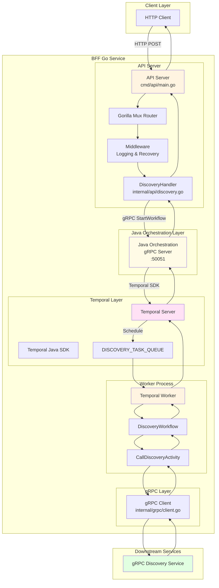
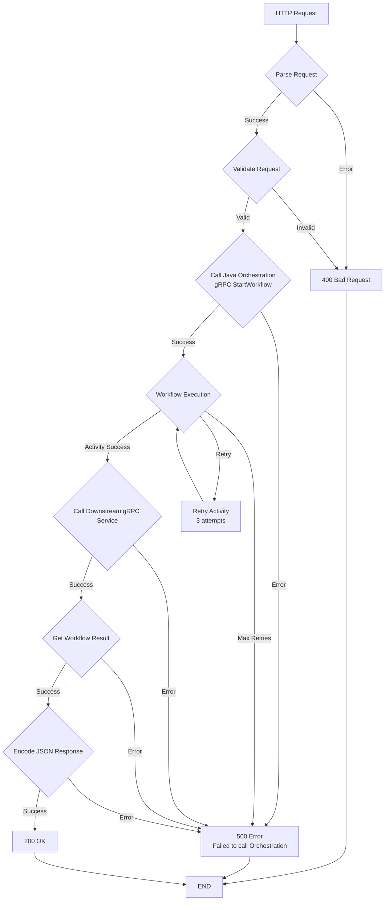

# BFF Go MVP - Flow Diagrams

This document contains Mermaid diagrams visualizing the architecture and request flow of the BFF service.

## Request Flow Sequence Diagram

```mermaid
sequenceDiagram
    participant Client
    participant APIServer as Go API Server
    participant Handler as DiscoveryHandler
    participant Orch as Java Orchestration (gRPC)
    participant Temporal as Temporal Server
    participant Worker as Temporal Worker
    participant Workflow as DiscoveryWorkflow
    participant Activity as CallDiscoveryActivity
    participant GRPCClient as gRPC Client
    participant GRPCService as Downstream gRPC Service

    Client->>APIServer: POST /discovery {payload}
    activate APIServer

    APIServer->>Handler: HandleDiscovery(request)
    activate Handler

    Handler->>Handler: Parse request; create txn_id (discovery-{txn_id})
    Handler->>Orch: StartWorkflow(StartRequest{workflow_type, payload, idempotency_key=txn_id, wait_for_completion=true})
    activate Orch

    Orch->>Temporal: StartWorkflow via Temporal SDK (set workflowId=idempotency_key)
    activate Temporal

    Temporal->>Worker: Schedule Workflow Execution
    activate Worker

    Worker->>Workflow: DiscoveryWorkflow(ctx, input)
    activate Workflow

    Workflow->>Activity: ExecuteActivity(CallDiscoveryActivity)
    activate Activity

    Activity->>GRPCClient: Dial downstream
    GRPCClient->>GRPCService: gRPC Call
    GRPCService-->>GRPCClient: DiscoveryResponse
    GRPCClient-->>Activity: DiscoveryResponse
    deactivate GRPCClient
    Activity-->>Workflow: DiscoveryResponse
    deactivate Activity

    Workflow-->>Worker: Workflow Result
    deactivate Workflow
    Worker-->>Temporal: Workflow Completed / Result
    deactivate Worker

    Temporal-->>Orch: SDK returns workflow result / getResult()
    deactivate Temporal

    Orch-->>Handler: StartWorkflow Response {workflowId, status=COMPLETED, result}
    deactivate Orch

    Handler->>Handler: Encode JSON result
    Handler-->>APIServer: HTTP response
    deactivate Handler

    APIServer-->>Client: 200 OK {final result}
    deactivate APIServer
```

## System Architecture Diagram



## Component Interaction Flow

```mermaid
flowchart LR
    subgraph "Client Request"
        A[HTTP Request<br/>POST /discovery]
        B[Parse JSON<br/>DiscoveryRequest]
        C[Generate Workflow ID]
        D[Call Java Orchestration<br/>gRPC StartWorkflow]
    end

    A --> B --> C --> D

    subgraph "Orchestration & Temporal"
        D --> E[Java Orchestration<br/>maps request → Temporal SDK]
        E --> F[Temporal Schedules Workflow]
    end

    subgraph "Workflow Execution"
        F --> G[Execute Activity<br/>Timeout 30s<br/>Retries 3]
        G --> H[Create gRPC Client<br/>Call Downstream Service]
        H --> I[Receive Response]
    end

    subgraph "Response Flow"
        I --> J[Return Activity Result]
        J --> K[Workflow Completes]
        K --> L[Orchestration Responds]
        L --> M[JSON Response to Client]
    end
```



## Error Handling Flow



## Synchronous mode: proto + code examples

### Suggested orchestration.proto (sync support)

```proto
syntax = "proto3";
package orchestration;

message StartRequest {
  string idempotency_key = 1;
  string workflow_type = 2;
  bytes payload = 3;
  bool wait_for_completion = 4; // when true, server waits and returns final result
  int32 max_wait_seconds = 5;  // optional server-side guard
}

message StartResponse {
  string workflow_id = 1;
  string run_id = 2;
  string status = 3; // STARTED, RUNNING, COMPLETED, FAILED
  bytes result = 4;  // final result when wait_for_completion=true
  string failure_message = 5;
}

service Orchestration {
  rpc StartWorkflow(StartRequest) returns (StartResponse);
}
```

### Go (gRPC client) — synchronous call example

```go
// ctx: context with timeout
ctx, cancel := context.WithTimeout(context.Background(), 40*time.Second)
defer cancel()

txnID := fmt.Sprintf("discovery-%s", uuid.NewString())
req := &orchestrationpb.StartRequest{
    IdempotencyKey:   txnID,
    WorkflowType:     "DiscoveryWorkflow",
    Payload:          []byte(jsonPayload),
    WaitForCompletion: true,
    MaxWaitSeconds:   35,
}

resp, err := orchClient.StartWorkflow(ctx, req)
if err != nil {
    if status.Code(err) == codes.DeadlineExceeded {
        writeHTTPError(w, http.StatusGatewayTimeout, "orchestration timeout")
        return
    }
    writeHTTPError(w, http.StatusInternalServerError, "orchestration failed")
    return
}

if resp.GetStatus() == "COMPLETED" && len(resp.GetResult()) > 0 {
    w.Header().Set("Content-Type", "application/json")
    w.WriteHeader(http.StatusOK)
    w.Write(resp.GetResult())
    return
}

w.Header().Set("Content-Type", "application/json")
w.WriteHeader(http.StatusAccepted)
fmt.Fprintf(w, `{"workflowId":"%s","status":"%s"}` , resp.GetWorkflowId(), resp.GetStatus())
```

### Java (gRPC server) — start workflow and wait for result (don't block IO threads)

```java
@Override
public void startWorkflow(StartRequest req, StreamObserver<StartResponse> responseObserver) {
    String workflowId = req.getIdempotencyKey();
    WorkflowOptions options = WorkflowOptions.newBuilder()
        .setWorkflowId(workflowId)
        .setTaskQueue("DISCOVERY_TASK_QUEUE")
        .build();

    DiscoveryWorkflow workflow = temporalClient.newWorkflowStub(DiscoveryWorkflow.class, options);

    // Start the workflow asynchronously
    WorkflowClient.start(workflow::run, req.getPayload().toStringUtf8());

    if (!req.getWaitForCompletion()) {
        StartResponse resp = StartResponse.newBuilder()
            .setWorkflowId(workflowId)
            .setStatus("STARTED")
            .build();
        responseObserver.onNext(resp);
        responseObserver.onCompleted();
        return;
    }

    // Wait for result on a dedicated blocking executor
    blockingExecutor.submit(() -> {
        try {
            WorkflowStub untyped = WorkflowStub.fromTyped(workflow);
            String result = untyped.getResult(String.class); // blocks until completion

            StartResponse resp = StartResponse.newBuilder()
                .setWorkflowId(workflowId)
                .setStatus("COMPLETED")
                .setResult(ByteString.copyFromUtf8(result))
                .build();

            responseObserver.onNext(resp);
            responseObserver.onCompleted();
        } catch (WorkflowFailedException wfe) {
            StartResponse resp = StartResponse.newBuilder()
                .setWorkflowId(workflowId)
                .setStatus("FAILED")
                .setFailureMessage(wfe.getMessage())
                .build();
            responseObserver.onNext(resp);
            responseObserver.onCompleted();
        } catch (Exception e) {
            responseObserver.onError(Status.INTERNAL.withDescription(e.getMessage()).withCause(e).asRuntimeException());
        }
    });
}
```
